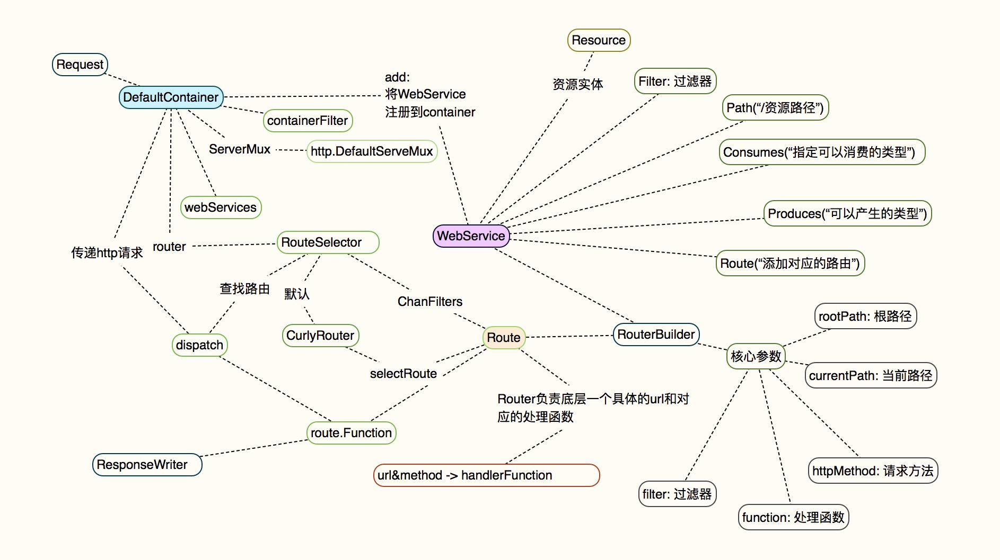

# GO Web learn

### link
- http://www.sreguide.com/2018/05/16/go/go_restful_01/

### swagger link
- https://medium.com/@ribice/serve-swaggerui-within-your-golang-application-5486748a5ed4
- https://github.com/emicklei/go-restful/blob/master/examples/restful-openapi.go
- https://github.com/swagger-api/swagger-ui
- https://swagger.io/blog/api-development/integrating-with-the-swaggerhub-api/
- https://sourcegraph.com/github.com/emicklei/go-restful@master/-/blob/examples/restful-swagger.go#L34
- https://github.com/emicklei/go-restful-swagger12

### need to do
- shell script use template
- web shell
- front web
- swagger doc